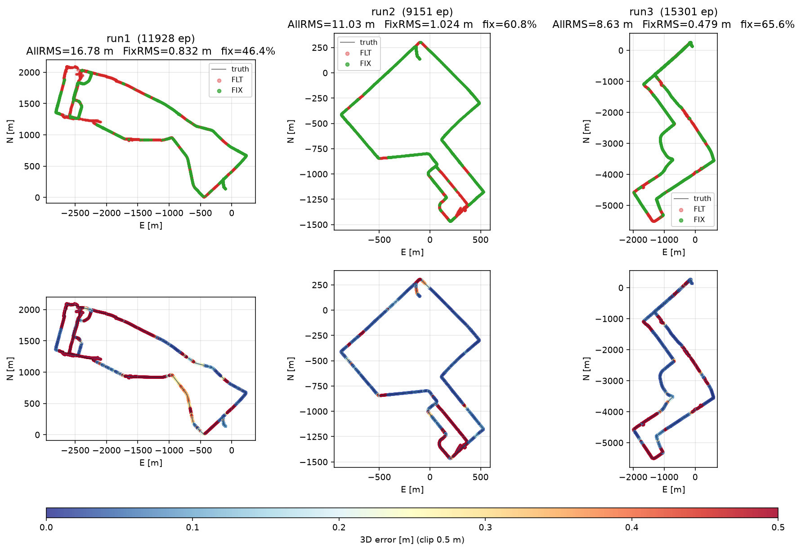

# tightly-coupled-gnss-imu-fgo

A vehicle positioning engine: RTK GNSS and a 100 Hz IMU fused in one
factor-graph estimator, aiming for centimeter FIX solutions in deep
urban environments where GNSS-only RTK breaks down.

**What it does.** Given rover/base RINEX observations, broadcast
ephemerides and raw IMU samples, it outputs a 5 Hz trajectory with
integer-fixed carrier-phase accuracy wherever the sky allows, and
IMU-bridged dead reckoning where it does not (NLOS storms, GDOP
collapse, tunnels).

**How.** Every epoch adds factors to a GTSAM incremental fixed-lag
smoother — double-differenced pseudorange and carrier phase (cssrlib
front end), IMU preintegration (`CombinedImuFactor`), between-satellite
single-differenced Doppler for velocity, and vehicle constraints (NHC,
ZUPT). Carrier ambiguities are estimated as float states in the graph,
fixed by LAMBDA (cssrlib's resolver or the native `ar/` port of it,
with demo5-style retry and partial AR), and pinned by fix-and-hold.
Post-fit residual tests, FDE and a recovery ladder (CP-hold →
ambiguity reset → DDPR re-anchor → warm reset) keep one bad epoch from
poisoning the graph.

**What's not here.** No PPP/SSR corrections, no RTCM streaming, no
GLONASS (FDMA biases don't cancel in the double difference), no wheel
odometry — the NHC constraint stands in for it.

---

## Install

Requirements: Linux x86_64, Python 3.11 or 3.12. Both GNSS
dependencies come from forks — **the stock PyPI `gtsam` and `cssrlib`
will not work** (they lack the DD/Doppler/NHC factors and the layered
DD front end this pipeline is built on).

```bash
git clone https://github.com/inuex35/tightly-coupled-gnss-imu-fgo
cd tightly-coupled-gnss-imu-fgo
python3.12 -m venv venv && . venv/bin/activate
pip install numpy matplotlib

# 1) GTSAM — prebuilt wheel with this project's factors, rebuilt weekly
#    against upstream gtsam develop. With the GitHub CLI:
gh release download custom-wheels-latest -R inuex35/gtsam -p '*cp312*'
pip install gtsam_develop-*.whl
#    Without gh: pick the cp311/cp312 wheel from
#    https://github.com/inuex35/gtsam/releases/tag/custom-wheels-latest

# 2) cssrlib — the inuex35 fork's DD-only RTK core (pinned)
pip install -e "git+https://github.com/inuex35/cssrlib-numba.git@55e0c29#egg=cssrlib"
```

There is no packaging for this repo yet — run everything from the
source tree (the example script sets its own `sys.path`). Datasets are
not included; the results below use the tokyo PPC set laid out as
`data/PPC-Dataset/tokyo/run{1,2,3}/{rover.obs,base.obs,base.nav,imu.csv,reference.csv}`.

<details>
<summary>Building GTSAM from source instead</summary>

Clone `inuex35/gtsam`, branch `custom/develop` (upstream develop + the
custom factors, re-merged weekly), then:

```bash
cmake -B build -DGTSAM_BUILD_PYTHON=1 -DPYTHON_EXECUTABLE=$(which python)
make -C build -j4 python-install   # ~20 min, ~11 GB RAM
```
</details>

---

## Run

```bash
LEVER_ARM=0.31,0,0.55 \
python examples/run_imu_gnss_tc.py \
  rover.obs base.obs base.nav imu.csv reference.csv
```

Inputs: rover/base RINEX observations, broadcast nav, 100 Hz IMU CSV
(FLU body frame), and a truth trajectory CSV — used only for the error
columns in the log. Signals are auto-detected from the RINEX headers
(up to 3 bands per system; GLONASS is excluded — FDMA biases do not
cancel in the double difference). Add `SAVE_NPZ=out.npz` for per-epoch
diagnostics.

### Results — tokyo PPC, full length, all defaults

NF=3: GPS L1/L2/L5, Galileo E1/E5a/E5b, QZSS L1/L2/L5, BDS B1C/B1I/B2a.
5 Hz epochs, vehicle-mounted consumer-grade IMU, deep urban Tokyo.

| run  | length    | AllRMS  | median  | p90    | FixRMS  | fix %  | <50 cm |
|------|-----------|---------|---------|--------|---------|--------|--------|
| run1 | 11928 ep  | 21.35 m | 0.23 m  | 34.6 m | 0.65 m  | 49.6 % | 55.4 % |
| run2 |  9151 ep  |  6.34 m | 0.053 m |  3.7 m | 0.35 m  | 67.6 % | 75.4 % |
| run3 | 15301 ep  | 18.61 m | 0.051 m |  6.8 m | 0.47 m  | 67.8 % | 71.5 % |

run1 is the hardest route: its tail is one deep canyon plus a full
tunnel blackout, bridged by IMU + SD Doppler dead reckoning.



---

## Architecture

Phase 1 (`phase1_rtk.py`) is stationary GNSS-only RTK used to bootstrap
attitude and biases; Phase 2 is the moving IMU+DD pipeline. Every
Phase-2 epoch flows through five stages:

```
A  preprocess/stage.py        IMU preintegration, prediction, IMU chain
B  preprocess/gate.py         slip/CMC detection, holds, prev-N carry, GDOP gate
C  optimize/stage.py          C1 build → C2 smoother → C3 AR → C4 post-fit diag
D  validation/postprocess.py  FIX/FLT verdict, innovation policy
E  validation/output.py       result tuple + bookkeeping
```

| Where | What |
|---|---|
| `runner.py` | `ImuGnssTc`: state owner; the cssrlib engine boundary is one explicit ten-method delegation block |
| `tightly_coupled.py` | Phase-2 epoch entry (`run_tc_epoch`) and the Phase-1→2 transition |
| `recovery.py` | cross-cutting escape paths: GDOP skip, IMU-only epochs, warm reset, solve-failure handling |
| `buildfactor/` | one module per factor family: DD PR/CP, ambiguity seeding (`amb_seed.py`), SD Doppler, raw Doppler, NHC, ZUPT, TDCP, IMU preintegration |
| `optimize/` | `build.py` (C1), `isam.py` (C2: ISAM2/fixed-lag glue), `ar_stage.py` (C3), `postfit_diag.py` (C4) |
| `validation/` | `residuals.py` (residual tests, FDE, DDPR sanity), `postprocess.py` (D), `output.py` (E) |
| `ar/` | native ambiguity resolution: LAMBDA core, demo5-style retry, subset search, fix-and-hold, cssrlib nav bridge |
| `epoch_data.py`, `stage_contract.py` | the `EpochData` carrier and its per-stage reads/writes contract (`ENABLE_STAGE_CONTRACT_CHECK=1`) |

---

## Configuration

Every knob is an env var mirroring a `TcConfig` field — see `config.py`
for the complete, commented list. The ones you will actually touch:

| Knob | Default | Effect |
|---|---|---|
| `LEVER_ARM` | `0,0,0` | IMU → antenna lever arm, body FLU [m] |
| `MAX_EP` | all | stop after N epochs |
| `SAVE_NPZ` | off | write per-epoch diagnostics |
| `DOPPLER_SD_SIGMA` | `0.5` | SD Doppler σ [m/s]; `0` disables |
| `DOPPLER_HUBER` | `1.0` | robust width on SD Doppler [m/s] |
| `AR_NATIVE_RESOLVER` | `0` | `1` = the native `ar/` LAMBDA path instead of cssrlib's |

`TC_PRESET=<name>` applies a named bundle first; explicit env vars
still win.

