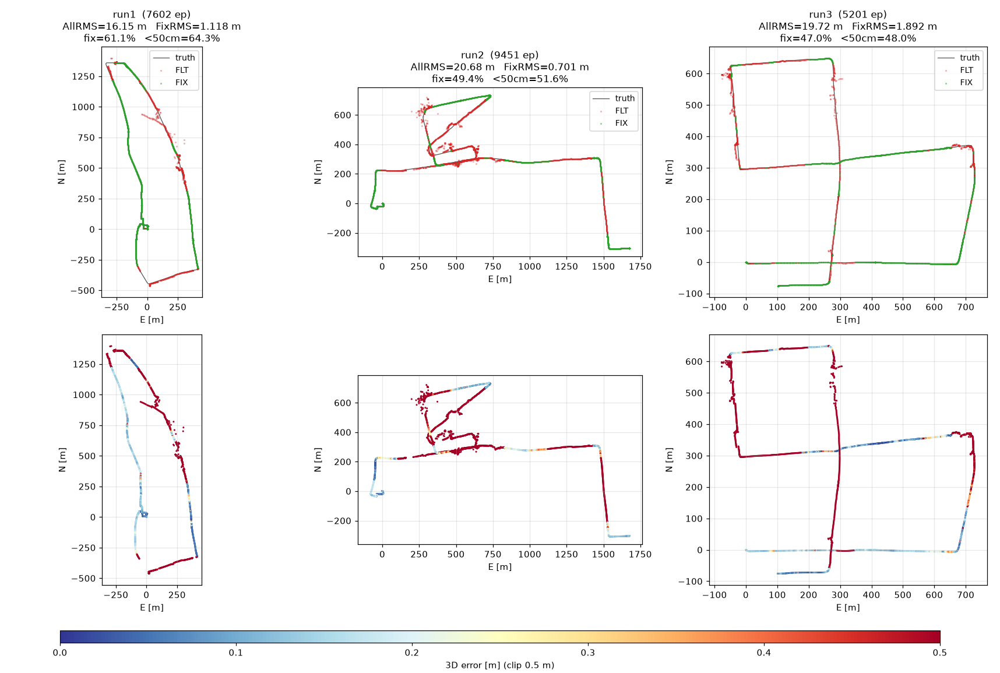

# tightly-coupled-gnss-imu-fgo

**Open-source tightly-coupled GNSS RTK + IMU factor-graph optimization**

*carrier-phase RTK · LAMBDA ambiguity resolution · GTSAM · urban driving · reproducible*

The full RTK chain lives inside the graph: double-differenced
pseudorange **and carrier phase**, integer ambiguity resolution
(LAMBDA, exclusion retry, partial AR) with fix-and-hold, FDE, and
100 Hz IMU preintegration — targeting centimeter FIX in deep urban
canyons, with IMU + single-differenced Doppler bridging NLOS storms
and tunnels.

## What's inside

- **RTK in the graph** — DD pseudorange + DD carrier-phase factors on a
  GTSAM `IncrementalFixedLagSmoother`, ambiguities as float states,
  clock-free seeding (SD phase − SD code)
- **Integer ambiguity resolution** — LAMBDA with ratio test, exclusion
  retry, partial AR, fix-and-hold, and geometry/residual acceptance
  gates
- **Tight IMU coupling** — 100 Hz `CombinedImuFactor` preintegration;
  NHC and ZUPT vehicle constraints (C++ factors with exact Jacobians)
- **Velocity through outages** — between-satellite single-differenced
  Doppler (clock-free), injected on every epoch
- **Integrity & recovery** — LLI + geometry-free slip detection,
  post-fit FDE, and an escalation ladder from CP-hold to warm reset
- **Contributed upstream** — the DD, Doppler and undifferenced GNSS
  factors are merged into
  [GTSAM](https://github.com/borglab/gtsam) itself; see the
  [gtsam.org post](https://gtsam.org/2026/06/10/rtk-gnss-double-difference.html)
  for the technique

## Results


Everything is measured on open data with all-default settings, and is
reproducible end to end — three full urban-Tokyo drives and three
urban-Nagoya drives
([PPC-Dataset](https://github.com/taroz/PPC-Dataset)), plus the
GREAT-MSF w2 window (Wuhan):

| run         | length    | AllRMS  | median  | FixRMS  | fix %  | <50 cm |
|-------------|-----------|---------|---------|---------|--------|--------|
| tokyo run1  | 11928 ep  | 14.17 m | 0.110 m | 0.55 m  | 62.3 % | 69.2 % |
| tokyo run2  |  9151 ep  |  7.09 m | 0.053 m | 0.85 m  | 69.7 % | 74.5 % |
| tokyo run3  | 15301 ep  |  5.58 m | 0.062 m | 0.31 m  | 70.0 % | 73.4 % |
| nagoya run1 |  7602 ep  | 16.15 m | 0.146 m | 1.12 m  | 61.1 % | 64.3 % |
| nagoya run2 |  9451 ep  | 20.68 m | 0.319 m | 0.70 m  | 49.4 % | 51.6 % |
| nagoya run3 |  5201 ep  | 19.72 m | 0.578 m | 1.89 m  | 47.0 % | 48.0 % |
| MSF w2      |  1041 ep  |  0.17 m | 0.141 m | 0.14 m  | 99.0 % | 99.5 % |

tokyo run1 is the hardest route — a deep canyon plus a full tunnel
blackout, bridged by IMU + SD Doppler dead reckoning.



The defaults admit each satellite on the bands it actually transmits
(`SAT_BAND_PLAN=1` — a pre-IIF GPS without L5 or a B1I-only BDS-2 is
judged on what it broadcasts instead of being discarded wholesale) and
run LAMBDA's ratio test against the demo5/FFRT dimension-adaptive
threshold (`AR_THRESAR_MIN=1.5`, `AR_THRESAR_MAX=3.0`) instead of a
fixed 2.0. The two were adopted together after being measured across
all seven datasets above — together they are the best all-round
configuration on five of the seven, and on tokyo run3 they beat the
previous defaults on every metric at once (fix 65.5 → 70.0 %, AllRMS
11.05 → 5.58 m, FixRMS 0.573 → 0.305 m). Revert to the previous
behaviour with `SAT_BAND_PLAN=0 AR_THRESAR_MIN=0 AR_THRESAR_MAX=0`.

## Quick start

Linux x86_64, Python 3.12 (CI-tested; 3.11 should work). **Stock PyPI `gtsam`/`cssrlib` will
not work** — both come from forks:

```bash
python3.12 -m venv venv && . venv/bin/activate
pip install numpy matplotlib

# GTSAM wheel with the custom factors (DD, Doppler, SD Doppler, NHC),
# rebuilt weekly against upstream develop:
gh release download custom-wheels-latest -R inuex35/gtsam -p '*cp312*manylinux*' -D wheels
pip install "$(ls wheels/*.whl | sort | tail -1)"   # newest, in case the rolling release carries a stale one

# cssrlib DD-only RTK core (pinned; this revision carries the
# nav.sat_band_plan admission policy the defaults use -- on an older
# cssrlib the flag is silently inert and admission stays strict):
pip install "cssrlib @ git+https://github.com/inuex35/cssrlib.git@750a48e2ba7a2322d8a46cb8caeb7436f21ae66e"
```

Run (datasets not included; lay out PPC-Dataset under
`data/PPC-Dataset/tokyo/run{1,2,3}/`):

```bash
LEVER_ARM=0.31,0,0.55 \
python examples/run_imu_gnss_tc.py \
  rover.obs base.obs base.nav imu.csv reference.csv
```

## Architecture

Packages are the roles:

| Package | Role |
|---|---|
| `pipeline/` | the epoch flow: `imu_prediction` → `quality_gate` → `solve` (`measurement_factors` / `update_smoother` / `fix_ambiguities` / `check_postfit`) → `validate_fix` → `report` |
| `factors/` | measurement → GTSAM factor builders, one file per family |
| `ar/` | LAMBDA core, exclusion retry, subset search, fix-and-hold |
| `integrity/` | slip detection, sanity ladder, outage recovery |
| `state/` | records (`SatState`, `EpochData`) and the stage I/O contract |

Phase 1 bootstrap (stationary GNSS-only) is `initialization.py`;
`runner.py` owns state and the cssrlib boundary.

## Configuration

Every `config.py` field is an env var (`DOPPLER_SD_SIGMA`,
`SIG_PR`, `ZUPT_MAX_SPEED`, …) — see `config.py` for the complete,
commented list. The example script adds its own env switches
(`LEVER_ARM`, `MAX_EP`, `SAVE_NPZ`, …).
The measured defaults and their reverts: `SAT_BAND_PLAN=0` (strict
all-band admission), `AR_THRESAR_MIN=0 AR_THRESAR_MAX=0` (fixed AR
ratio threshold), `P1_FDE_ENABLE=0` (no Phase-1 FDE screen).
A few recovery-path priors (warm-reset and outage anchors,
Phase-2 seed sigmas) are hardcoded constants, not knobs.

## License

BSD 3-Clause. Built on [GTSAM](https://github.com/borglab/gtsam) and
[cssrlib](https://github.com/hirokawa/cssrlib); evaluated on
[PPC-Dataset](https://github.com/taroz/PPC-Dataset).
